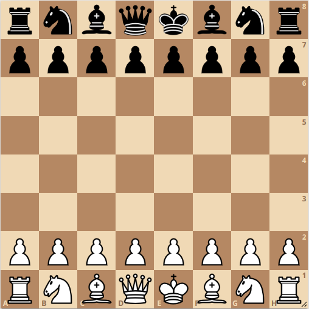
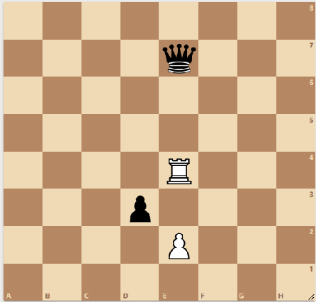

# Chess-Challenges

These projects are my first coding experience at university, focuses on Object-oriented Programming usnig Java language. The objective was to learn OOP model to organize software design around data, or objects, rather than functions and logic.

## Overview

### Project 1: Check the moves

In this project, the current state of a chess game are given by the user.We want to see what moves can be done in the current state.

#### How does it work?

The first line of the input contains the number 𝑛 , which is the total number of pieces on the chess board. 

𝑛 next line each specifies the type and location of the pieces. Each of these 𝑛 lines contains a 4-character string: 

- The first character specifies the color of the piece, which can be one of two characters: W, which means white, or B, which means black.

- The second character specifies the type of piece (like R for Rook and K for Knight)

- The third and fourth characters specify the location of the piece.

After the pieces are specified, the next line contains 𝑚, which means the number of questions, and the questions are located in 𝑚 of the next line.

Each question contains a 4-character string:
- the first two characters of which indicate the initial location of the moving pieces

- the second two characters of the desired location for the movement of the pieces.



#### The output

The output should contain 𝑚 lines, each line containing the answer to a question.

The answer to each question is one of the three words **YES**, which means that it is possible to move, **NO**, which means that the move is not correct, and **TAKE**, which means that with this move, a piece from the opposite side is taken.

#### Example

- **Input :**
   ```sh
   4
   WRE4
   BQE7
   WPE2
   BPD3
   5
   E2E3
   E2E4
   E4E7
   E4E1
   D3E2


- **Output :**
   ```sh
   YES
   NO
   TAKE
   NO
   TAKE
### Project 2: Count the possible moves

In this project, the current state of a chess game are given by the user.We want to count the number of possible moves of a particular piece.

#### How does it work?

The mechanism of this project is the same as the previous one, with the difference that each question contains a character string of length 2 that specifies the location of the desired piece to count the number of moves.

#### Example

- **Input :**
   ```sh
   4
   WRE4
   BQE7
   WPE2
   BPD3
   3
   E2
   E4
   D3


- **Output :**
   ```sh
   2
   11
   2
## Installation

Follow these steps to install the project:

1. Clone the repository:
   ```sh
   git clone https://github.com/Amizaa/Chess-Challenges.git

Feel free to explore the repository and provide feedback!